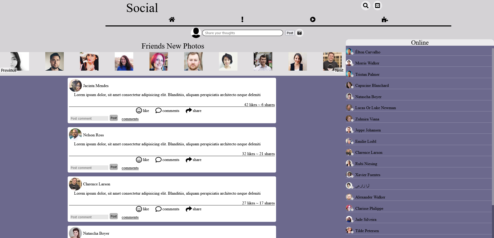

# social-media
<h3>This was made using HTML,CSS/Scss,JS/jquery. </h3>

click here to try <a href="https://rivveneyes.github.io/social-media/">HERE</a> 

 
<h2>SUMMARY</h2>
<h3>This porject was a focus towards useing jquery and scss.The ideah of the layout came from fb home page its a rough coppy
there is some basic functionality.but mainly pratice was the focus for creating this project.</h3>
<h3>AUTHOR</h3>
Joshua Garcia- <a href="https://joshua-personal-website.herokuapp.com/">My Site
  </a>|<a href="https://www.linkedin.com/in/joshua-garica-04351520b/">Linkedin
  </a>
